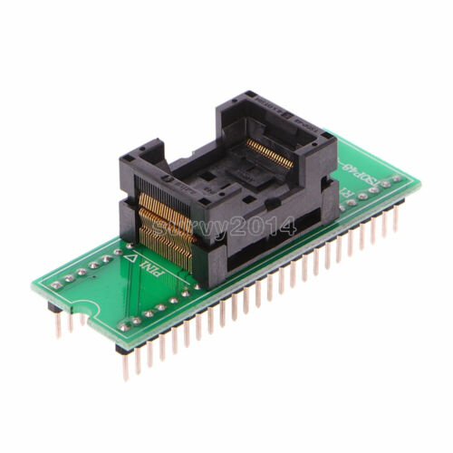

# OpenXenium JTAG and Flash Memory Chip programmer

**This is based on work done by [kooscode](https://github.com/kooscode/xenium-programmer) and [Ryzee119](https://github.com/ryzee119/openxenium) with modifications to program the bare ICs.  Most of the code here was done by kooscode (please visit the link above).

--------------

## * Read: ["Home Brew" on ORIGINAL XBOX](XBOX.md) - a detailed article on why and how *

The tools in this repo will allow you to use a Raspberry PI to program the CPLD and Flash Memory chips of the OpenXenium via Jtag and a custom 4-bit bus NOR Flash programming protocol.
Original project mentioned above allowed the use of an Onion Omega2+... This has been removed for this project. 

### Raspberry PI:
- This has only been tested on PI Zero W and PI 3B+ models so far.

https://www.pishop.us/product/raspberry-pi-zero-w/

-------------
## INSTALLING THE XENIUM PROGRAMMER

- Connect to the PI via SSH or Serial terminal 
- Clone this repo by running: `git clone https://github.com/dtomcat/XP-chip.git`
- Then run: `./install`

## UPDATING XENIUM PROGRAMMER

- Connect to the PI via SSH or Serial terminal 
- Pull the latest code with: `git pull`
- Then run: `./install` 

-------------
## PROGRAMMING THE XENIUM CPLD AND/OR FLASH MEMORY (STANDALONE)

- After the PI has fully booted and the green led is on...
    - Press the FIRST button to program both ICs. (both ICs must be inserted into their respective sockets)
    - Hold the FIRST button to program the CPLD with the Bit Bang firmware. (Only the CPLD must be inserted, Flash is optional)
    - Press the SECOND button to program the flash chip. (**The CPLD must be present and have the Bit Bang firmware loaded or this will fail.  Both Chips must be inserted)
    - Press the THIRD button to program the CPLD with the OpenXenium Firmware. (Only the CPLD must be inserted, Flash is optional)
    - Press the FOURTH button to clear any errors.
    - Hold the FOURTH button to shutdown the Raspberry Pi.

-------------
## PROGRAMMING THE XENIUM CPLD AND/OR FLASH MEMORY (SSH/SERIAL)
This is good to do if you keep getting an error trying to program the chips. (Red LED remains on)

- Connect to the PI via SSH or Serial terminal
- Change dir to XP-chip
- You can program CPLD and FLASH in one single step. (Both must be inserted into their respective sockets)
    - Run: `./xenium-programmer-smd`
- You can program just the CPLD in one two ways. (Only the CPLD needs to be inserted into it's socket)
    - To program the Bit Bang firmware: 
        - Run: `./BitBangOnly`
    - To program the OpenXenium firmware: 
        - Run: `./OX-Only_SMD`
- You can program just the Flash. (Both must be inserted into their respective sockets, and the CPLD MUST have the Bit Bang Firmware loaded)
    - Run: `./FlashOnly`

-------------

### PC BOARD

Huge thanks to James Bolding for the Original Eagle PCB hardware design!
This PCB design is based on his original work and the work of Ryzee119's OpenXenium.  

- You can use the FREE Eagle PCB to load this up or just use the gerber files to have the PCB made at OSH Park!

--------------

### PARTS NOT LISTED IN BOM
The two sockets were sourced from Ebay (linked below).  They may be available from another source, but the design is based off these particular sockets.  If you decide to go with another source, they may not line up/work.

- CPLD Socket: [QFP64 TQFP64 to DIP64 Pitch 0.5mm IC Programmer Adapter Test Socket](https://www.ebay.com/itm/172825294343)
    
- Flash Socket: [TSOP48 To DIP48 Double Contact Gold Plating Universal IC Programm Socket Adapter](https://www.ebay.com/itm/402764448631)
    
    

-------------
## CREDITS

- Koos du Preez - Creator (kdupreez@hotmail.com - Comments, improvements, critique, etc. is welcome!)
- Dtomcat - CHIP programmer PCB design.
- James Bolding - Orignal hardware design and PCB!
- Ryzee119 -  OpenXenium Firmware and hardware and all round awesomeness!
- XC3SPROG - Not sure who to thank here, but the source code was pivotal in making this work!
